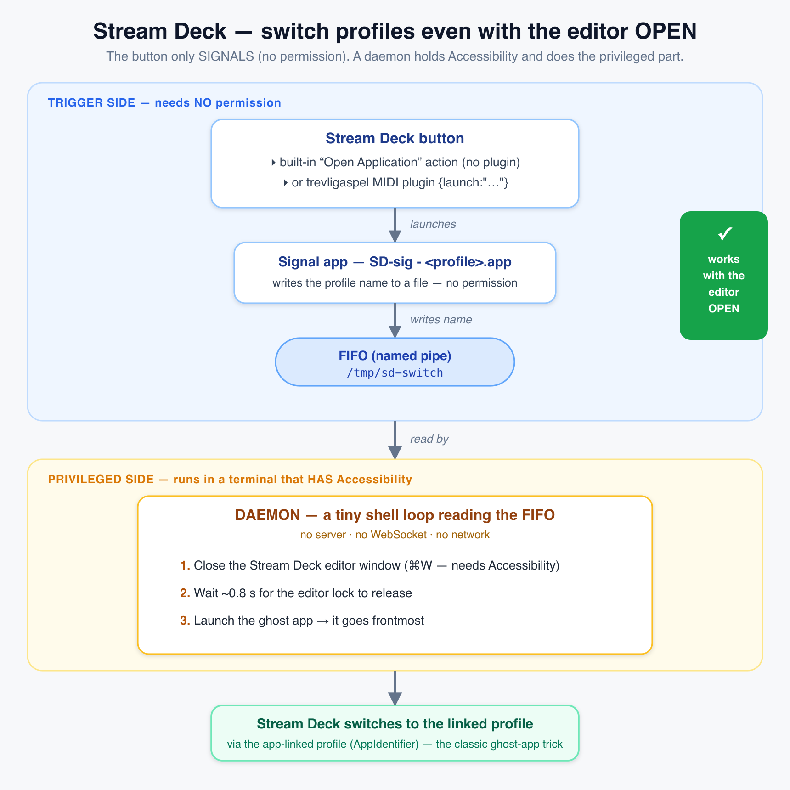

# Stream Deck — switch profiles by name, from the command line

Switch your Elgato **Stream Deck** to any profile **by its name**, from a
script or the terminal — **even when the Stream Deck configuration window is
open**.

```bash
sd-profile.sh "Live Set"
sd-profile.sh "Ableton — Record"
```

No plugin to write, no WebSocket server to keep alive. Just macOS + a small
technique Stream Deck already supports: **app-linked profiles** ("ghost apps").

> Uses only documented, supported Stream Deck features (app-linked profiles)
> and standard macOS automation. Nothing about the Stream Deck software is
> modified, reverse-engineered, or bypassed. See [Investigations & findings](#investigations--findings).

---

## The need

You're mid-set (or mid-edit) and you want a **button — or a MIDI script, or a
shell command — to jump the Stream Deck to a named profile.** Stream Deck offers
no such command, and every known workaround breaks the moment the configuration
window is open. This project makes it work anyway, reliably.

## The constraints we work within (Apple + Elgato)

This is harder than it should be because of deliberate choices by **both**
vendors — none of which we can change. The whole design is shaped by them:

**Elgato**
- No public "switch to profile X by name" command for scripts.
- Profile switching (app-linked *and* the WebSocket API) is **suppressed while
  the configuration window is open** — an editing-coherence lock.
- The API explicitly forbids third-party plugins from switching user profiles.

**Apple (macOS)**
- Closing the editor window programmatically requires **Accessibility**
  permission — a manual, per-machine grant that cannot be automated.
- **Ad-hoc-signed AppleScript applets never get a working Accessibility grant**
  (verified: `-25211` even when enabled; a properly signed helper still failed
  to post keystrokes, `1002`). So the app a button launches can't do it itself.

**This project is the simplest approach we have found that stays _compatible_
with all of the above** — it works *within* the limitations instead of fighting
them (no reverse-engineering, no bypass, only documented features + standard
automation). It is almost certainly not the only way. **If you know a simpler
or better path that respects the same constraints, please open an issue or PR**
— see [Contributing & alternatives](#contributing--alternatives).

---

## Why this is harder than it should be

Stream Deck has no public "switch to profile X by name" command for scripts.
It exposes profile switching only in two ways, and **both are intentionally
suppressed while the Stream Deck configuration window is open**:

- the WebSocket `switchToProfile` API (plugins only), and
- the on-deck *Switch Profile* button action.

That block isn't a bug. **While the editor window is open, it live-previews
the profile you're editing directly on the hardware.** If a background switch
could change the active profile out from under you, the deck would show one
profile while you edit another — so Stream Deck holds the active profile on the
edited one until you close the window. It's an editing-coherence behaviour.

**The consequence drives the whole design:** since a switch can't take effect
while the editor is open, the tool's first step is to **close the editor
window** (`Cmd-W`; Stream Deck keeps running in the menu bar). Once that window
is closed, the switch goes through normally.

## The mechanism: app-linked profiles + a focus bounce

Stream Deck supports **app-specific profiles**: bind a profile to an
application, and Stream Deck switches to that profile whenever the app becomes
frontmost. A **ghost app** uses this: it's a near-empty AppleScript applet
whose only job is to become frontmost for ~0.45 s and quit.

`sd-profile.sh` puts the two pieces together:

1. **Close the editor window** if it's open — done by the *script*, from your
   terminal (`Cmd-W` via System Events). This is the step that needs
   Accessibility permission, and a terminal is a properly signed app that can
   hold it reliably (see findings below).
2. **Launch the ghost app** for the target profile → it becomes frontmost →
   Stream Deck switches to the bound profile → the ghost app quits and focus
   returns to whatever you were doing.

```
sd-profile.sh "Live Set"
   │
   ├─ 1. editor window open?  ──yes──▶ close it (Cmd-W, from the terminal)
   │                                            │
   └──────────────── no ────────────────────────┤
                                                 ▼
                     2. launch ghost app  →  it becomes frontmost
                                                 ▼
                        Stream Deck switches to the bound profile
                                                 ▼
                                    ghost app quits
```

The ghost app itself does **nothing but switch** — it needs no permission. All
the editor-closing lives in `sd-profile.sh`, run from your terminal.

---

## Requirements

- macOS
- The Elgato **Stream Deck** app (tested on 7.5)
- One **ghost app per profile** you want to switch to (built below)
- **Accessibility permission for your terminal** — only needed to auto-close the
  editor window; see [Permissions](#permissions-one-time)

## Install

```bash
git clone https://github.com/Beennnn/streamdeck-profile-switch.git
cd streamdeck-profile-switch
chmod +x bin/*.sh
# optional: put bin/ on your PATH, or symlink sd-profile.sh somewhere handy
```

## Create a ghost app for a profile

Two steps: **build the app**, then **bind it** in Stream Deck (one time).

### 1. Build

```bash
bin/make-ghost-app.sh "Live Set"
```

This creates `SD_switch - Live Set.app` in Stream Deck's `ProfileApps`
folder. (It's a normal AppleScript applet — you can also build it by hand:
open **Script Editor**, paste [`ghost-app/main.applescript`](ghost-app/main.applescript),
and *Export…* as an Application.)

### 2. Bind it in Stream Deck

1. Select the target profile in the Stream Deck app.
2. Open the profile's settings (the **•••** / gear next to the profile name).
3. Choose **set as profile for an application**, and pick the ghost app you
   just built.

Stream Deck records the app's path in the profile's `AppIdentifier`. That's
the link `sd-profile.sh` reads to know which app to launch for a given name.

## Switch by name

```bash
sd-profile.sh "Live Set"          # exact (case-insensitive) or unique substring
sd-profile.sh --list              # list switchable profiles
sd-profile.sh --list all          # list every profile (incl. non-switchable)
sd-profile.sh --no-close-config … # don't touch the editor window
```

Ambiguous names print the candidates and switch nothing. Profiles without a
linked ghost app are reported as not switchable.

## Permissions (one time)

**To auto-close the editor window**, `sd-profile.sh` sends `Cmd-W` through macOS
**System Events**, which requires **Accessibility** permission for the app that
sends it — i.e. **your terminal**:

**System Settings → Privacy & Security → Accessibility** → enable your terminal
(Terminal, iTerm, …).

That's the only permission needed. If you skip it, everything still runs — the
editor just won't be closed automatically, so switching only works when the
editor is already closed (or when you close it yourself first). Pass
`--no-close-config` to skip the close step entirely.

Ghost apps themselves need **no permission** — they only become frontmost and
quit.

## Trigger a switch from a button — even with the editor open

This is the part that took the most digging, so here is the whole architecture
and *why it is shaped this way*.

### The architecture



```
  Stream Deck BUTTON                         (needs NO permission)
   ├─ built-in "Open Application" action ──┐
   ├─ trevligaspel MIDI plugin {launch}    │   launches a tiny
   └─ OSAScript / any launcher             │   "signal app"…
                                           ▼
              SD-sig - <profile>.app  ──►  writes "<profile>" to a FIFO (/tmp/sd-switch)
                                           │
        ┌──────────────────────────────────▼───────────────────────────────┐
        │  DAEMON — a small shell loop reading the FIFO                      │
        │  (runs in a process that HOLDS Accessibility: a terminal, or a     │
        │   launchd agent). It runs sd-profile.sh "<profile>":               │
        │     1. close the Stream Deck editor window   (Cmd-W, needs Accessibility)
        │     2. wait ~0.8 s for the editor lock to release                  │
        │     3. launch the ghost app → it goes frontmost → SD switches      │
        └───────────────────────────────────────────────────────────────────┘
```

### Why it is shaped this way (what we learned)

- **You must close the editor first.** While the editor window is open, *every*
  switch mechanism (app-linked profiles, the WebSocket API) is suppressed.
  Closing it needs Accessibility.
- **The button can't close the editor itself.** The apps a button launches are
  ad-hoc-signed, and **ad-hoc AppleScript applets never get a working
  Accessibility grant** on current macOS (verified: `-25211` even when granted;
  a *properly signed* helper got further but failed posting keystrokes with
  `1002`). See [findings](#investigations--findings).
- **So we decouple:** the button only **signals** (writes a file — zero
  permission), and a **daemon** that *does* hold Accessibility (because it runs
  inside a terminal you granted it) does the privileged close-then-switch. This
  is the crux.
- **A physical deck press fires its action even while the editor is open** (the
  editor only intercepts *software* clicks on keys, not hardware presses) — so a
  signalling button works while you edit.

### Setup

1. **Grant your terminal Accessibility** (System Settings → Privacy & Security →
   Accessibility). This is the *only* permission in the whole system.
2. **Run the daemon** (from that terminal, or a launchd agent):
   ```bash
   bin/sd-switch-daemon.sh                 # watches /tmp/sd-switch
   ```
3. **Build one signal app per profile** and **bind a button to launch it**:
   ```bash
   bin/make-signal-app.sh "Live Set"       # → ~/Applications/SD-sig - Live Set.app
   ```
   Then, on a button, use **either**:
   - the built-in **"Open Application"** action → pick `SD-sig - Live Set.app`
     *(no plugin, no MIDI — this is the "base Stream Deck" path)*; **or**
   - the trevligaspel MIDI plugin, script `[(press){launch:"…/SD-sig - Live Set.app"}]`.

   Both were tested working **with the editor open**.

> **Note — one app per profile.** The built-in "Open Application" action does
> **not** forward its *Arguments* field to the launched app (verified), so the
> profile name is baked into each signal app rather than passed as an argument.
> `make-signal-app.sh` generates them; they need no permission and no binding.

### Run it permanently (LaunchAgent — no terminal window)

Running `bin/sd-switch-daemon.sh` from a terminal works, but that terminal has to
stay open. To have the daemon **start at login and stay up with no visible
window**:

```bash
./install.sh
```

This installs a LaunchAgent (`~/Library/LaunchAgents/com.streamdeck-profile-switch.daemon.plist`,
`RunAtLoad` + `KeepAlive`) that runs the daemon via `/bin/bash`.

Then grant Accessibility **to `/bin/bash`** (the LaunchAgent's program):
System Settings → Privacy & Security → Accessibility → **+** → `⌘⇧G` →
`/bin/bash` → add it → enable the toggle. Because the daemon now runs under
launchd (not your terminal), it's `/bin/bash` — not Terminal — that needs the
grant. **Verified working.**

**Re-run `./install.sh` after granting**, so the daemon restarts and picks up the
permission — TCC is evaluated when the process starts, so a daemon launched
*before* the grant won't see it. (This is the one gotcha.)

- Enabling `/bin/bash` is a **broad** grant (every bash script gets
  Accessibility) — fine on a personal machine; to scope it tighter you'd host the
  daemon in a properly signed app instead (not shipped here).
- `./install.sh --uninstall` removes the LaunchAgent.
- Generate ghost + signal apps for all switchable profiles at once with
  [`bin/gen-apps.sh`](bin/gen-apps.sh).

### Editor-window commands (hide / show / toggle)

The daemon also understands three **reserved words** that control the config
window instead of switching a profile:

| word | effect |
|---|---|
| `hide` (`masquer`) | close the editor window |
| `show` (`afficher`) | open the editor window |
| `toggle` (`bascule`) | close if open, open if closed |

Same plumbing as a profile switch — build a signal app and bind a button:

```bash
bin/make-signal-app.sh "hide"      # → SD-sig - hide.app  (button launches it)
echo hide > /tmp/sd-switch          # or straight from a shell / script
```

(These names are reserved: a profile literally called `hide`/`show`/`toggle`
would be shadowed. See [`bin/sd-window.sh`](bin/sd-window.sh).)

### MIDI trigger (optional, no signal apps)

If you'd rather trigger from a **controller, pedal, Bome, or your DAW**,
[`bin/sd-switch-midi.py`](bin/sd-switch-midi.py) maps a MIDI note/CC → profile
(no per-profile apps, just a JSON map). It opens a virtual "SD Profile Switch"
port you route MIDI to. Requires `mido` + `python-rtmidi`.

```bash
bin/sd-switch-midi.py
```

### Response time

The `~0.8 s` in step 2 is the tunable knob (in `sd-profile.sh`): it's the delay
after closing the editor before switching, because Stream Deck releases the lock
a beat late (0.2 s was too short; ~0.8–1.3 s is reliable). It applies **only when
the editor was actually open** — with the editor closed (a live gig) there is no
wait and the switch is near-instant.

Keep the daemon alive from a login terminal, or a launchd agent (verify
Accessibility attribution for launchd-spawned processes in your setup).

---

## Investigations & findings

While hardening this on a real rig, a few things turned out to be non-obvious.
Recorded here so you don't have to rediscover them.

- **The editor lock suppresses *every* switch mechanism** — app-linked
  profiles *and* the WebSocket API. Confirmed empirically: with the config
  window open, launching a ghost app changes the frontmost app but the deck
  does not switch; the same launch switches instantly once the window is
  closed. There is no switch path that survives the open editor — closing the
  window first is unavoidable.

- **Physical deck presses DO fire while the editor is open.** The editor
  intercepts only *software* clicks on keys inside its window, not hardware
  presses — a button's action runs normally even while you're editing. What the
  open editor blocks is the *switch itself* (app-linked profiles / API), not the
  button firing. So a button that merely *signals* the daemon (an OSAScript
  `do shell script` writing the FIFO) works even with the editor open: the daemon
  holds the Accessibility to close the editor, then switches.

- **The built-in "Open Application" action does NOT forward its Arguments.** We
  hoped for a single signal app taking the profile name as an argument
  (`open -a app --args "X"` *does* deliver it), but the Stream Deck action
  launches the app without passing its Arguments field — the app receives none.
  So each profile gets its own baked-in signal app instead
  (`bin/make-signal-app.sh`). The trevligaspel `{launch}` command likewise passes
  its parameter as a *document* (`open -a app "X"`, treated as a file), not as an
  argument — same conclusion.

- **After closing the editor, wait ~0.8 s before switching.** The editor lock
  releases a beat after the window closes; 0.2 s dropped the switch, ~0.8–1.3 s is
  reliable. `sd-profile.sh` waits only when it actually closed a window, so the
  editor-closed path stays fast.

- **After closing the editor, wait before switching.** The editor lock is
  released a beat *after* the window closes. Close-then-switch in one tight
  sequence (0.2 s) is ignored; ~1.3 s is reliable. `sd-profile.sh` now waits
  that long — but only when it actually closed a window, so the editor-closed
  path (a live gig) stays fast.

- **Ad-hoc-signed AppleScript applets do NOT get functional Accessibility.**
  An earlier design had each *ghost app* close the editor itself. It never
  worked: with Accessibility granted to the ghost app and its toggle enabled,
  `count of windows` on the Stream Deck process still returns **-25211**
  ("not authorized to send Apple events / accessibility"). This was reproduced
  with the app at a stable local path (ruling out symlinked/cloud paths) and
  after re-signing the applet with a self-signed certificate — macOS lists the
  entry but does not validate it for an ad-hoc/AppleScript-applet identity.
  Sending a keystroke from such an app fails the same way (error `1002`,
  "not allowed to send keystrokes"). **Conclusion:** the editor close must be
  driven by a **properly signed** app that can hold Accessibility — in practice,
  **your terminal**. Hence the design above: the script closes the editor, the
  ghost app only switches.

- **`keystroke` posting and UI reading both need Accessibility.** It's not
  enough to grant Automation ("control System Events"): reading `count of
  windows` and posting `Cmd-W` both require the *sending* app to hold
  Accessibility. Automation alone gets you past the consent prompt but still
  fails these calls.

- **Dwell time matters.** A ghost app that quits after 0.1 s sometimes quits
  before Stream Deck registers the frontmost-app change, so the switch is
  missed. Staying frontmost ~0.45 s makes it reliable. (See
  [`ghost-app/main.applescript`](ghost-app/main.applescript).)

- **Bundle identifier / signing on ghost apps is now irrelevant.** Since the
  ghost apps no longer touch System Events, they need no Automation or
  Accessibility grant at all — so there's nothing to share across them.

---

## Files

| Path | What it is |
|---|---|
| [`bin/sd-profile.sh`](bin/sd-profile.sh) | CLI: close the editor (from the terminal) then switch a profile by name |
| [`bin/sd-switch-daemon.sh`](bin/sd-switch-daemon.sh) | FIFO watcher: switch by writing a profile name to `/tmp/sd-switch` (works even with the editor open) |
| [`bin/sd-switch-midi.py`](bin/sd-switch-midi.py) | MIDI watcher: a note/CC switches a profile (trigger from a controller, pedal, Bome, or DAW) |
| [`bin/sd-midi-map.example.json`](bin/sd-midi-map.example.json) | example note/CC → profile map (copy to `sd-midi-map.json`, which is git-ignored) |
| [`bin/make-ghost-app.sh`](bin/make-ghost-app.sh) | Build a `SD_switch - <name>.app` ghost app (the switch target) |
| [`bin/make-signal-app.sh`](bin/make-signal-app.sh) | Build a `SD-sig - <name>.app` signal app (a button launches it to trigger the daemon; works with the editor open) |
| [`ghost-app/main.applescript`](ghost-app/main.applescript) | The applet source (become frontmost → quit) |

## Contributing & alternatives

This is deliberately open. The approach here is the **simplest one we could find
that stays compatible with the Apple + Elgato constraints above** — but it is
not elegant (a background daemon, an Accessibility grant, one small app per
profile) and it is very likely not the only path.

If you can find a **simpler or cleaner alternative that respects the same
constraints** — a way to close the editor without Accessibility, a single app
that receives the profile name, a proper signed helper that holds Accessibility
reliably, a real Stream Deck plugin, anything — **please open an issue or a PR.**
The [Investigations & findings](#investigations--findings) section documents the
dead ends we already hit, so you don't have to repeat them. Corrections welcome
too: if a finding here is wrong on your macOS / Stream Deck version, say so.

## Disclaimer

Personal project, **not affiliated with, authorized, or endorsed by Elgato or
Corsair**. *Stream Deck* and *Elgato* are trademarks of Corsair. This tool uses
only documented, supported Stream Deck features (app-linked profiles) together
with standard macOS automation; it does not modify, reverse-engineer, or bypass
any Elgato software.

## License

MIT — see [LICENSE](LICENSE).
